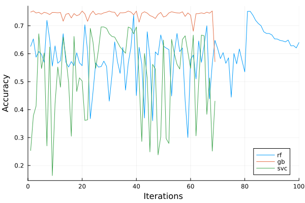

# Hyperparameter optimization report

## Introduction

This report is a summary of the pipeline optimization process for the models used to predict the white wine quality with `winequality-white.csv` dataset. This pipeline optimization is largely based on the previous assignment on hyperparameter optimization with additions on the preprocessing tunning. Since there are only seven different quality levels (i.e. 3-9), I treat this problem as a classification problem. The pipeline consists of three components: a scaler, a dimension reducer, a ML model. The goal is to find the best preprocessing methods and hyperparameters for the pipeline to maximize the accuracy of the predictions. Three ML models are used in this report: Random Forest, Gradient Boosting, and Support Vector Machine. The scalers are `RobustScaler`, `PowerTransformer`, `Normalizer`, `StandardScaler`, `MinMaxScaler`, and `StandardScaler`. The dimension reducers are `PCA`, `FastICA`.

## Dataset description

The white wine dataset contains 4898 observations with 12 columns in each observation. There is no missing data in the dataset. The target variable is `quality`, which is an integer between 3 and 9. The rest of the columns are features of the wine. I consider all feature columns as continuous numerical variables. The dataset is divided into 70% training and 30% testing.

## Experiment setup

Similar to the HPO assignment, I used Julia to run the experiments with the two main packages `AutoMLPipeline` and `Hyperopt` to perform the hyperparameter optimization. A random seed is used to ensure experiment reproducibility. Given the type of the problem, I use accuracy as the metric to evaluate the model performance.

Nested resampling is used in the pipeline HPO process. A outer sampling is performed to split the dataset into 70% training and 30% testing. The inner sampling is performed with a 5-fold cross-validation to evaluate the model performance. The outer sampling is used to evaluate the model performance with the best hyperparameters found in the inner sampling.

I will discuss the experiment setup in two sections: preprocessing and hyperparameter optimization.

### Preprocessing

The preprocessing consists of two steps: scaling and dimension reduction. The scaling is performed before the dimension reduction. The scaling is performed with one of the six scalers aforementioned. The dimension reduction is performed with one of the two dimension reducers with number of components as a hyperparameter to be optimized. The number of components for PCA/FastICA is in the range [2, 20). The pipeline optimization process for preprocessing is to find the best combination of scaler, dimension reducer, and number of components to maximize the accuracy of the model.

### Hyperparameter optimization

The hyperparameter optimization is performed using the `Hyperopt` package using Hyperband with random sampler (RSHB). The maximum number of iterations is set to 50 for random sampler, and the resource for HB is R=50 with n=3. The best hyperparameters are selected based on the best accuracy.

## Results

### Random Forest

The hyperparameters to optimize are number of estimators with range [10, 500), max tree depth [1, 30), max number of features [1, 30), min samples split with range [2, 50) and min samples leaf range [1, 50). The best hyperparameters are shown in the table below.

| Category |5-fold test CV mean accuracy | n_estimators | max_depth | max_features | min_samples_split | min_samples_leaf | dim reducer | n_component | scaler|
|---------|-------------|------------------|-------------|-------------|-------------||-------------|-------------|----------|----------|
| Tuned pipeline |  0.5916 | 110 | 22 | 10 | 9 | 1 | PCA | 9 | PowerTransformer |
| Default model only | 0.6133 | 100 | None | sqrt | None | 0.0 | NA | NA | NA |

### Gradient Boosting

The hyperparameters to optimize are number of estimators with range [10, 500), learning rate [0.01, 0.5) and max depth [1, 30).

The best hyperparameters are shown in the table below.

| Category | 5-fold test CV mean accuracy | n_estimators | learning_rate | max_depth | min_samples_split | min_samples_leaf | dim reducer | n_component | scaler|
|---------|---------|-------------|------------------|-------------|----------|----------|----------|
| Tuned pipeline | 0.5759 | 198 | 0.1733 | 7 | 9 | 11 | PCA | 9 | StandardScaler |
| Default model only | 0.5616 | 100 | 0.1 | 3 | 2 | 1 | NA | NA | NA |

### Support Vector Machine

The hyperparameters to optimize are C (regularization) with range [0.1, 10), kernels have these options [linear, poly, rbf, sigmoid], and gamma with range [1, 10). The performance plot for the RSHB is shown below.

| Category | 5-fold test CV mean accuracy | C | kernel | gamma | dim reducer | n_component | scaler|
|---------|---------|-------------|------------------|-------------|----------|----------|----------|
| Tuned pipeline |0.5589 | 7.1 | rbf | 6 | ICA | 17 | StandardScaler |
| Default model only | 0.4541 | 1 | rbf | 'scale' | NA | NA | NA |

## Conclusion

The boxplot is shown below to compare the performance of the three models with different pipeline using Hyperband with random sampler.

The figure above shows that the random forest has the best overall performance among the three models. It has highest average accuracy but there are some outliers. The gradient boosting has the second best performance and with the similar dispersion as the random forest., and the SVM has the worst performance. The SVM model has the highest dispersion and lowest average accuracy. The results on the test dataset also agree with this trend. The pipelines for random forest and gradient boosting both reply on PCA as dimension reducer and power transformation as scaler. Among six scalers, only power transformation and standard scaler are selected and SVM with standard scaler has much higher dispersion than the other two with power transformation. This would mean that many features in the dataset are not normally distributed and the power transformation is used to transform the data to be more Gaussian-like.

The figure above shows the performance (convergence) of the three models with different pipelines in the tuning process. We can observe that all three models reach
plateau near 20 - 40 iterations before dropping, which means all models have explored regions with higher accuracy and there is a good balance between exploration and exploitation.

From three tables above, we can observe that the tuned random forest pipeline's performance is slightly worse than that of the default model-only pipeline. While the performance for
the tuned gradient boosting and SVM pipelines are better than that of the default model-only pipelines. This indicates that the hyperparameter optimization process is effective for gradient boosting and SVM models but not for the random forest model. 

Revision: I think the tunned pipeline for random forest is worst than the default model is likely due to many I expanded the hyperparameter search space for the Random forest model and the SVC to include `min_samples_split` and `min_samples_leaf`. I also triple the search iterations. However, the results are still very similar. The accuracy of tunned random forest pipeline is still worse than that of the default model-only pipeline. This indicates that the hyperparameter optimization process is not effective for the random forest model. The reason is because the search iterations might not high enough to find the globally best hyperparameters. The plateau in the performance plots show that at least the HPO process reached some locally optimal parameters. The hyperparameter optimization process is effective for gradient boosting and SVM models but not for the random forest model.

To improve the performance of the random forest model, I would increase the search iterations further and search space for the hyperparameters. I would also use a different hyperparameter optimization algorithm such as Bayesian optimization (BOHB).